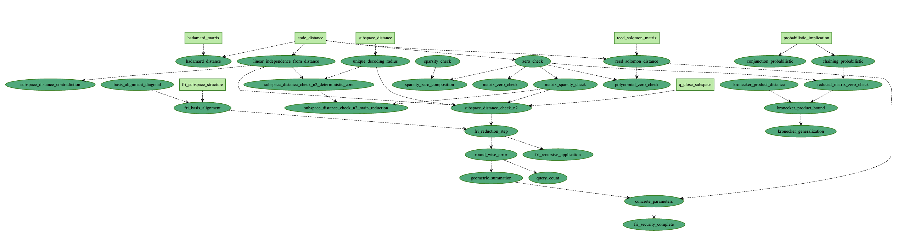

# Certifying the FRI protocol

An AI-assisted Lean 4 formalization of the Fast Reed–Solomon Interactive Oracle Proof (FRI) protocol, a core component of modern transparent, STARK-style zero-knowledge proofs.

This project starts from elementary linear algebra (matrix multiplication, code distance, random sampling) and builds all the way up to a fully machine-checked security proof for FRI with concrete soundness bounds, following the framework of Evans–Angeris ["Succinct Proofs and Linear Algebra"](https://eprint.iacr.org/2023/1478).

All the Lean statements and proofs were produced by **Gauss**, Math Inc.'s autoformalization agent, guided by a LaTeX blueprint.



---

## Highlights

- **Target:** full security proof of the FRI protocol.
- **Scope:** ≈2k lines of Lean.
- **Workflow:** AI-generated formalization from a LaTeX blueprint with human scaffolding.
- **Foundation:** linear-algebraic view on Reed–Solomon codes, distance, and random subspace tests.
- **Result:** a complete Lean theorem stating FRI soundness with concrete parameters, error < $2^{-79}$, and $O(n^{0.585})$ query complexity.

---

## Links

- **Project page:** <https://app.math.inc/zk-linalg>
- **Blueprint (web):** <https://math-inc.github.io/ZkLinalg/blueprint>
- **Blueprint (PDF):** <https://math-inc.github.io/ZkLinalg/blueprint.pdf>
- **Documentation:** <https://math-inc.github.io/ZkLinalg/docs/>
- **Math Inc.:** <https://www.math.inc/>
- **Gauss (autoformalization agent):** <https://www.math.inc/gauss>

---

## Repository layout

- `ZkLinalg/` – main Lean development of the linear-algebraic framework and FRI security proof.
- `ZkLinalg.lean` – top-level Lean entry point.
- `blueprint/` – LaTeX blueprint, including the dependency graph and web/PDF build assets.
- `home_page/` – Jekyll-based landing page used for the project website.

---

## Building

You will need:

- [Lean 4](https://lean-lang.org/) with `lake`
- [uv](https://docs.astral.sh/uv/getting-started/installation/) for the
  blueprint tools
- A LaTeX installation (e.g. TeX Live) for the PDF

### Lean development

```bash
lake exe cache get && lake build
```

### Blueprint (PDF)

```bash
uvx leanblueprint pdf
```

### Blueprint (web + local server)

```bash
uvx leanblueprint web
uvx leanblueprint serve
```

The generated site is served locally; by default the blueprint index is at
`http://localhost:8000/`.

---

## About

This repository is part of Math Inc.'s broader effort to apply AI-assisted
formal verification to modern cryptographic protocols and zero-knowledge proof
systems. Faster, lower-friction formalization can make complex proving
infrastructure easier to audit, extend, and trust.

For questions or collaborations, please reach out via
<https://www.math.inc/>.

---

## References

- Alex Evans and Guillermo Angeris, *Succinct Proofs and Linear Algebra*,
  Cryptology ePrint Archive, Paper 2023/1478. <https://eprint.iacr.org/2023/1478>
